# Email Classifier


## Problem

I had to classify a lot of emails from different accounts, and doing it by hand took enormous time and mental bandwidth.

The goal of this project is to use machine learning to help with that, by assigning two or more labels to each email subject:

- a **Main Category** (like Admissions, Courses, Administration)
- a **Sub Category** (like Application Status, Exam Schedule, Meetings).

>  These categories are a **smaller, simplified version of the actual data**, basically **dummy data** created for demonstration purposes. In a real workflow, the categories would be defined based on the actual email domain and business context.

This would let me later analyze trends without wasting hours labeling manually.

### Why Subjects Instead of Content?

- Content may hold sensitive information I don’t want to expose.  

- Subjects are concise but usually carry enough signal in this case.  

- Faster training and easier preprocessing.

## Solution

I already had a small set of labeled data, so I decided to build a **semi-supervised machine learning workflow**.

- I first train a model on the labeled data.
- Use the model to predict labels for new incoming emails.  
- Add back the **most confident predictions** into the training dataset and retrain in iterations.  

For the classifier, I used a **Random Forest** because:

- It handles text features from TF-IDF reliably without needing heavy tuning.
- It works well with small to medium-sized datasets.
- It’s naturally robust to noise and overfitting.

This way the model improves over time, while I spend less time labeling.

## Workflow

```mermaid
flowchart LR
    A[📄 CSV data source] --> B[⚙️ ETL]
    B --> C[(🗄 SQLite DB)]
    C --> D[🤖 Train Supervised Model]
    D --> E[💾 Save Models]
    E --> F[🔍 Predict]
    
    F --> G[✨ High-confidence predictions]
    G --> H[🔄 Add back to Training Data]
    H --> |Semi-supervised loop| C

    F -->|Demo: OCR| I[🖼 Screenshot → OCR → Subject]
    F -->|Alt: Batch| J[📂 CSV / DB / API]
```



The workflow is split into **three main steps**, each handling one stage of the process:  

1. **ETL Pipeline (`clean_update.py`)**  

- Reads subjects from a CSV.  

- Cleans the data (removes `FW:`, `RE:`, dates, IDs, codes).  

- Write the cleaned datainto a local SQLite database.  

2. **Model Training (`train_model.py`)**  

- Reads clean data from SQLite.  

- Transforms subject text into numerical features using **TF-IDF vectorization**.  

- Trains a **MultiOutput Random Forest classifier** on those features to predict **both labels at once**.  

- Evaluates performance and saves both the vectorizer and the model for reuse.

3. **Prediction (`predict.py`)** 

- In this demo I show **OCR from a screen region** to prove the end-to-end flow:
  - Take a screenshot of an email subject.  
  -  Extract text with OCR.  
  - Apply the saved TF-IDF vectorizer + classifier to predict labels.  

>  OCR is just an example input. The model works with any text source. You can batch-predict from files, loop over a folder, pull from a database, or even crawl the web as long as giving it subject strings.

So:

```
CSV → ETL Pipeline → SQLite → Training → Save Model + Vectorizer → OCR/Input → Predict
```


## Project Layout

```
.
├── clean_update.py
├── train_model.py
├── predict.py
├── run_pipeline.ipynb
├── data/
│   └── demo_emails.csv
├── db/
│   └── dataset.db
├── model/
│   ├── multioutput_classifier.joblib
│   └── tfidf_vectorizer.joblib
├── reports/
│   └── classification_report_1.txt
├── README.md
├── requirements.txt
└── .gitignore
```

## How To Run It

### **1. Clean and Update the data**

```
from clean_update import update
update("data/demo_emails.csv",
       db_path="db/dataset.db",
       table="emails",
       if_exists='replace') # change to append after first feeding
```

### **2. Train the model**

```
from train_model import train_and_evaluate
train_and_evaluate(db_path='db/dataset.db',
                   table= 'emails',
                   report_file='reports/classification_report_1.txt',
                   test_size= 0.2,
                   random_state= None)
```

### **3. Predict on new emails (via OCR )**

```
import joblib
from predict import ocr_predict

vec = joblib.load("model/tfidf_vectorizer.joblib")
model = joblib.load("model/multioutput_classifier.joblib")

# Subject-line screen region (x, y, width, height)
region = (1346, 140, 280, 26)

# One call: capture → OCR → predict
subject_text, main, sub = ocr_predict(region, vec, model, debug=True)
```

## Example Output

```
OCR Subject: Annual Budget Meeting Rescheduled
Predicted → Main: Administration | Sub: Budget
```

## Next Steps / Future Improvements  

- **Include body content securely**: 
  Right now classification is subject-only. In the future, the model could incorporate email body text (while handling sensitive information carefully) to improve accuracy.  

- **Handle class imbalance**: 
  Some subcategories have very few examples, making predictions unstable. Future work could use techniques like data augmentation, SMOTE, or class-weighted models.  

- **Automate the semi-supervised loop**: 
  Currently I manually add back high-confidence predictions into the database for retraining. A future improvement is to automate this process with a confidence threshold.  


